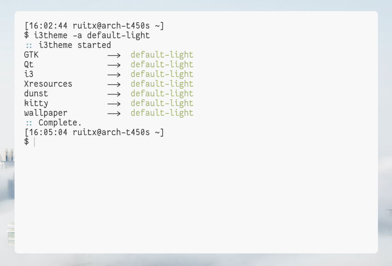

<div id="top"></div>
<!--
*** Thanks for checking out the Best-README-Template. If you have a suggestion
*** that would make this better, please fork the repo and create a pull request
*** or simply open an issue with the tag "enhancement".
*** Don't forget to give the project a star!
*** Thanks again! Now go create something AMAZING! :D
-->

<!-- PROJECT LOGO -->
<br />
<div align="center">
  <h3 align="center">i3theme</h3>
  <p align="center">
    Simple i3 theme changer
    <br />
  </p>
</div>


<!-- ABOUT THE PROJECT -->
## About The Project



<!--


-->

i3theme is a simple script that changes i3 theme from a list of avaiable themes. It changes automatically i3 and i3status configs, Xresources, dunst, GTK and QT (not working atm).

<p align="right">(<a href="#top">back to top</a>)</p>

<!-- GETTING STARTED -->
## Getting Started

### Prerequisites

i3themes needs ```xsettingsd jq feh```
jq to parse the JSON theme file, xsettingsd for GTK themes and feh for the wallpaper
* jq
  ```sh
  pacman -Syu jq xsettingsd feh
  ```

### Installation

1. Download it [here](https://github.com/rtxx/scripts/tree/main/i3theme)
2. Run it
   ```sh
   bash i3theme -h
   ```
Make sure its inside a folder with the directory 'themes', or else it wont work.

<p align="right">(<a href="#top">back to top</a>)</p>


<!-- USAGE EXAMPLES -->
## Usage

i3theme can be used to 

* Change the theme
  ```sh
  bash i3theme -t nord
  ```
* List avaiable themes
  ```sh
  bash i3theme -l
     ```
* For more uses do
  ```sh
  bash i3theme -h
     ```
### Notes
* Please backup all the configs files before running. Please inspect the script before running because it **will** change several files and overwrite your configuration.
* For the script to work, i3 and i3status must have the following folder structure:
```
i3
  | config.d
    | theme.conf
    | main.conf
  | config
  | makeconfig
```
``` makeconfig ``` _glues_ the ```main.conf``` and ```theme.conf``` and replaces ```config```. Same for i3status.
Check my i3 personal repo for more information.
* I personally use base16 based themes for i3 and i3status, so it needs more testing for other types of themes (I think is fine but YMMV).
* rxvt wont update on the fly its colors, please use ```kitty``` or other terminal that supports it. Thereś also [urxvt-config-reload](https://github.com/regnarg/urxvt-config-reload) if you need it.
<p align="right">(<a href="#top">back to top</a>)</p>


<!-- LICENSE -->
## License

Distributed under the MIT License. See `LICENSE` for more information.

<p align="right">(<a href="#top">back to top</a>)</p>

_Readme file made with template from https://github.com/othneildrew/Best-README-Template, thanks!_

<!-- MARKDOWN LINKS & IMAGES -->
<!-- https://www.markdownguide.org/basic-syntax/#reference-style-links -->
[product-screenshot]: screenshot1.png
