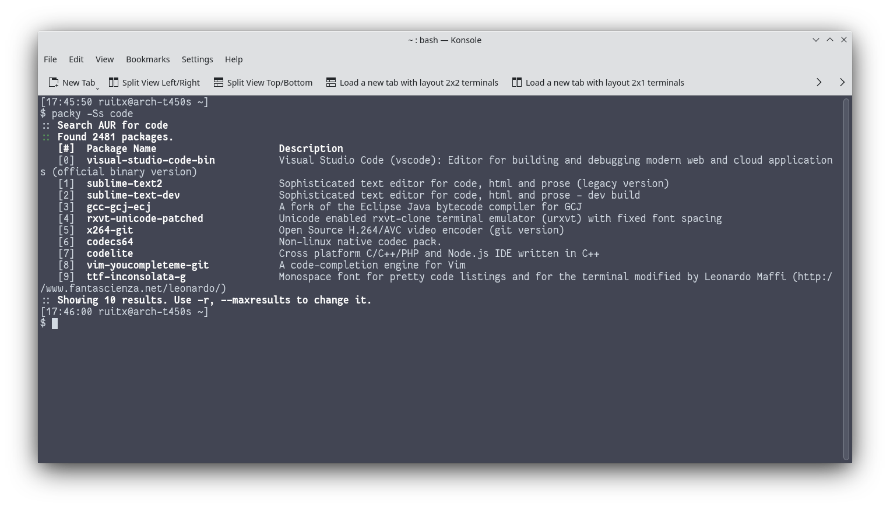

<div id="top"></div>
<!--
*** Thanks for checking out the Best-README-Template. If you have a suggestion
*** that would make this better, please fork the repo and create a pull request
*** or simply open an issue with the tag "enhancement".
*** Don't forget to give the project a star!
*** Thanks again! Now go create something AMAZING! :D
-->

<!-- PROJECT LOGO -->
<br />
<div align="center">
  <h3 align="center">Packy</h3>
  <p align="center">
    Simple AUR helper
    <br />
  </p>
</div>


<!-- ABOUT THE PROJECT -->
## About The Project



Packy is a simple AUR helper made with Bash. I made it to get more used to bash. It has as lot of badness but it works for me, and now I know a bit more because of it.

<p align="right">(<a href="#top">back to top</a>)</p>

<!-- GETTING STARTED -->
## Getting Started

### Prerequisites

Packy only needs jq, to parse JSON from the AUR API.
* jq
  ```sh
  pacman -Syu jq
  ```

### Installation

_Installing Packy is super simple. Because its only a script, you can run it anywhere._

1. Download it [here](https://github.com/rtxx/scripts/blob/main/packy/packy)
2. Run it
   ```sh
   bash packy
   ```
Make sure its inside a folder, so its easier to manage the downloaded packages.

<p align="right">(<a href="#top">back to top</a>)</p>


<!-- USAGE EXAMPLES -->
## Usage

Packy can be used to 

* Search
  ```sh
  bash packy -S gwe
  ```
* Download
  ```sh
  bash packy -Dx gwe
  ```
* and check for updates
  ```sh
  bash packy -U
  ```
* For more uses do
  ```sh
  bash packy -h
     ```
<p align="right">(<a href="#top">back to top</a>)</p>


<!-- LICENSE -->
## License

Distributed under the MIT License. See `LICENSE.txt` for more information.

<p align="right">(<a href="#top">back to top</a>)</p>


<!-- MARKDOWN LINKS & IMAGES -->
<!-- https://www.markdownguide.org/basic-syntax/#reference-style-links -->
[product-screenshot]: screenshot1.png
